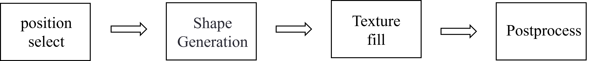

## Requirements
* python>=3.8
* SimpleITK==2.2.1
* mmcv==2.2.0
* numpy==1.24.3

## Synthetic Tumor Generation Method Based on Medical Prior Knowledge
In liver tumor segmentation tasks, the scarcity of annotated data (e.g., only 131 cases in the LiTS dataset) and the insufficient samples of early small tumors pose significant challenges. Traditional generative models (such as GANs or VAEs) tend to produce blurry boundaries or distorted shapes. This project innovatively proposes a procedural synthetic tumor generation framework that incorporates medical prior knowledge from the Liver Imaging Reporting and Data System (LI-RADS) to achieve high-fidelity tumor synthesis. This approach effectively alleviates the impact of data scarcity on model training.

## Data
* [LiTS](https://www.kaggle.com/andrewmvd/liver-tumor-segmentation) 131 CT scans for segmentation of the liver as well as tumor lesions.

# Date process

<p align="center"></p>

### 1. Intelligent Localization and Vessel Avoidance
This step focuses on ensuring anatomical accuracy by identifying vascular regions and preventing tumor generation in close proximity to critical structures.  
- **Vessel Segmentation**: The `segment_vessels` function identifies blood vessels using a predefined HU range (150–300).  
- **Safety Collision Detection**: The `gen_position` algorithm leverages distance transformation to maintain safe distances between generated tumors and nearby vessels, preserving realistic spatial relationships.

### 2. Multi-Stage Morphological Modeling
Tumor morphology is modeled through a combination of geometric foundations and advanced deformation techniques to simulate realistic shapes and textures.  
- **Basic Geometry**: A 3D ellipsoid serves as the initial structure to represent early-stage tumors with regular shapes.  
- **Advanced Deformations**:  
  - Elastic deformation dynamically adjusts based on tumor size to create irregularities.  
  - Fractal noise is applied to larger tumors (≥10mm) to generate lobulated edges, mimicking complex tumor boundaries.

### 3. Pathological Texture Synthesis
- **HU Value Modeling**:
  - **Necrotic Core**: Increases the HU value in the central region.
  - **Steatosis**: Random patches attenuate HU values.
- **Smoothing and Edge Enhancement**: Gaussian smoothing eliminates artificial artifacts, while morphological edge enhancement highlights the tumor capsule for better delineation.

<p align="center"></p>

## Run the codes
```bash
Run: python main.py -i input_dir -o output_dir
